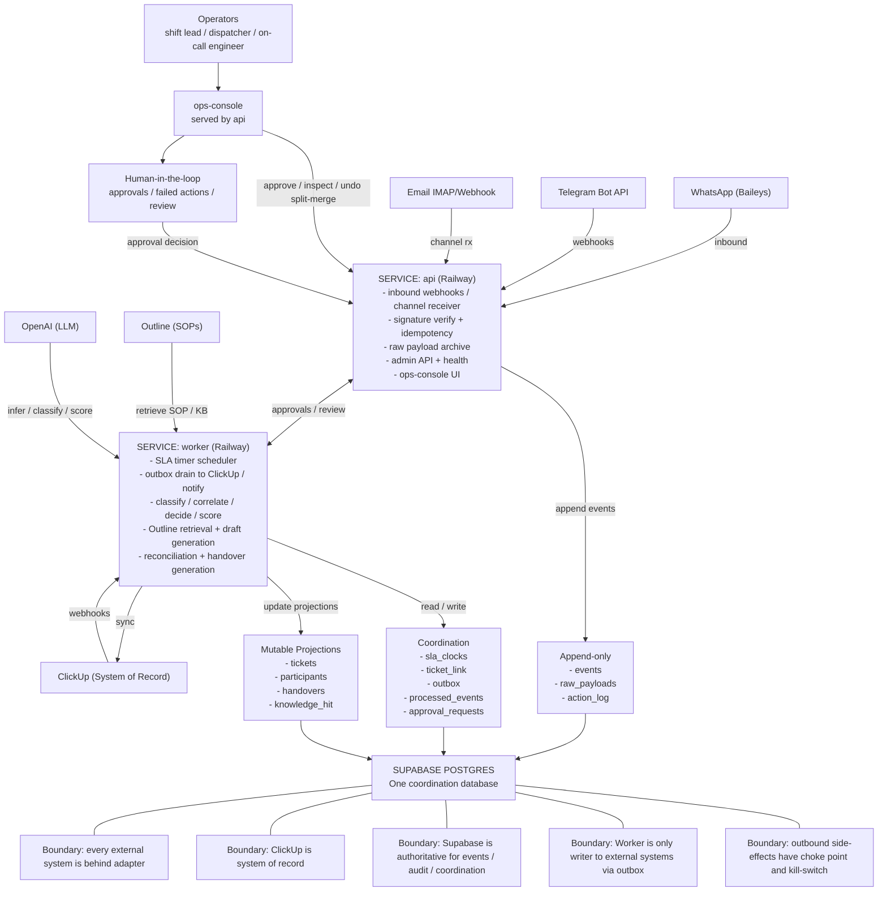

# Beacon - Unified Ticket Tracker V1


Project Beacon is the rebuild of **Unified Ticket Tracker (UTT) v0** into an operational alarm system for Hutabyte support operations.

The current UTT v0 works mainly as a passive notification and ticket forwarding service. Project Beacon upgrades it into a controlled intake, SLA reminder, ticket tracking, escalation, handover, and reporting system that helps the operations team make sure **no request is missed** and **no first-response SLA is breached**.

Beacon is not designed to replace human operators. It observes operational channels, classifies messages, creates structured ticket records, reminds the team before SLA risk, suggests SOP/PIC/escalation routes, and generates summaries. The final decision remains with the support team.

---

## Table of Contents

- [Overview](#overview)
- [Why Beacon](#why-beacon)
- [Current Version vs Rebuild Target](#current-version-vs-rebuild-target)
- [Business Problems](#business-problems)
- [Objectives](#objectives)
- [Scope](#scope)
- [Core Features](#core-features)
- [Project Phases](#project-phases)
- [Business Process: As-Is vs To-Be](#business-process-as-is-vs-to-be)
- [Target Solution Architecture](#target-solution-architecture)
- [Target Data Flow](#target-data-flow)
- [Tech Stack](#tech-stack)
- [Target Project Structure](#target-project-structure)
- [Database Design](#database-design)
- [API Documentation](#api-documentation)
- [Notification Format](#notification-format)
- [SLA Rules](#sla-rules)
- [AI Design](#ai-design)
- [Human-in-the-Loop Principle](#human-in-the-loop-principle)
- [Installation & Setup](#installation--setup)
- [Environment Variables](#environment-variables)
- [Running the Project](#running-the-project)
- [Requirement Matrix](#requirement-matrix)
- [Migration Plan from UTT v0](#migration-plan-from-utt-v0)
- [Security Notes](#security-notes)
- [Development Guidelines](#development-guidelines)
- [Known Gaps](#known-gaps)
- [Roadmap](#roadmap)
- [Contributing](#contributing)
- [Project Status](#project-status)

---

## Overview

Project Beacon consolidates requests from multiple operational channels into one controlled ticket intake.

```text
WhatsApp Groups / WhatsApp DM / Email / Telegram / Microsoft Teams
        ↓
Channel Intake Adapters
        ↓
Raw Intake Logging
        ↓
Message Normalization
        ↓
AI Triage, Classification, Summary, Priority, Project Detection
        ↓
Ticket Creation / Threading / No-Action Filtering
        ↓
SLA Timer + Reminder Engine
        ↓
Dashboard + Telegram/Teams Notification
        ↓
Human Review, Response, Escalation, Resolution
        ↓
Handover Summary + Operational Reports
```

Main goal:

> Turn UTT from a message forwarder into an operational control system.

---

## Why Beacon

A beacon is a lighthouse and a guiding signal in uncertainty.

The name represents the system's purpose:

- illuminate every incoming request,
- make SLA countdown visible,
- remind the team before a ticket is forgotten,
- guide operators to the right SOP or PIC,
- reduce blind spots across scattered communication channels.

---

## Current Version vs Rebuild Target

| Area | UTT v0 / Current Prototype | Project Beacon Rebuild |
|---|---|---|
| Main role | Passive alert and forwarding bot | Operational alarm and control system |
| Main channels | WhatsApp group, Telegram, limited email module | WhatsApp group, WhatsApp DM, Email, Telegram, Microsoft Teams |
| Ticket state | Basic status update | Full status, PIC, SLA, history, threading, audit log |
| SLA | Not consistent / limited reminder | First-response SLA timer, countdown, reminders, breach tracking |
| AI role | Basic classification and summary | Triage, relevance, project detection, summary, priority, SOP/PIC suggestions |
| Human control | Partially manual | Explicit human-in-the-loop principle |
| Reporting | Basic summary | Shift handover, daily/weekly/monthly reports, breach reports |
| Target reliability | MVP / proof of concept | Internal operational-grade v1 |

---

## Business Problems

The operations team currently receives requests from fragmented channels:

- WhatsApp groups and direct messages,
- Email,
- Telegram,
- Microsoft Teams.

This causes four major operational risks:

1. Requests can be missed because the team monitors multiple channels manually.
2. First-response SLA can drift because reminders are inconsistent.
3. Shift handovers and reports take around 30-60 minutes when prepared manually.
4. Escalation can stall because PIC and escalation paths are not always mapped clearly.

---

## Objectives

| Code | Objective | Success Indicator |
|---|---|---|
| OBJ-01 | Reduce the risk of missed requests | All requests from all monitored channels are recorded in one system |
| OBJ-02 | Maintain the 15-minute first-response SLA | Countdown timer and automatic reminders fire before SLA expiry |
| OBJ-03 | Turn UTT from a forwarder into a control system | UTT records status, PIC, SLA state, triage result, and ticket history |
| OBJ-04 | Speed up SOP search | Recommended SOPs or KB articles are surfaced on the ticket |
| OBJ-05 | Reduce repetitive manual work | Handovers and periodic reports are generated automatically |
| OBJ-06 | Maintain human-in-the-loop control | AI classifies, summarizes, and suggests; humans decide |

---

## Scope

### In Scope

- Consolidated monitoring of L2 WhatsApp groups and direct messages.
- Email, Telegram, and Microsoft Teams intake.
- Single active-ticket view with status, source channel, SLA timer, and PIC.
- First-response SLA reminders.
- Progress-update reminders and draft update messages.
- Standard Telegram notification format.
- AI-generated summary, project detection, relevance classification, priority classification, and suggested action.
- SOP and knowledge base recommendation by ticket category.
- Ticket-category to PIC/escalation mapping.
- Conversation threading to link follow-up messages to existing tickets.
- Filtering of no-action messages such as FYI, thank-you, info-only, and irrelevant messages.
- Auto-summary for shift handover.
- Periodic daily, weekly, monthly, and quarterly reports.
- Risk detection and stale-knowledge flagging.

### Out of Scope

- AI giving final L2 solution without human validation.
- AI auto-executing final operational action without approval.
- Replacing ClickUp, Microsoft Excel, or Outline as systems of record.
- Customer-facing channels such as Instagram, Messenger, web widget, or customer portal.
- Outbound forwarding to external helpdesk/CRM tools such as Zendesk, Jira, HubSpot, or Salesforce.
- Multi-tenancy.
- Large-scale migration of historical ticket data.

---

## Core Features

### Intake & Ticket Tracker

- Capture WhatsApp group messages.
- Capture WhatsApp direct messages.
- Capture email requests.
- Capture Telegram and Microsoft Teams notifications.
- Store every raw message as traceable raw intake.
- Normalize channel-specific messages into one standard format.
- Detect whether a message requires action.
- Create ticket automatically for actionable requests.
- Generate Ticket ID automatically.
- Assign initial status such as `New` or `Open`.
- Assign priority: `Low`, `Medium`, `High`, or `Critical`.

### SLA & Daily Operations

- Start SLA countdown when a ticket is created.
- Apply SLA rules by priority.
- Send first-response reminders before SLA expiry.
- Detect whether a valid first response has been sent.
- Stop initial response SLA timer after valid response.
- Send progress-update nudges for stale tickets.
- Provide dashboard filtering and search.
- Keep complete ticket history and audit logs.

### Threading & Noise Reduction

- Detect duplicate messages.
- Link follow-up messages to existing tickets.
- Append follow-up messages into ticket history.
- Mark no-action messages as `No Action Needed`.
- Reduce duplicate ticket creation.

### Escalation & Reporting

- Recommend PIC based on project, category, priority, and mapping.
- Detect escalation-needed tickets.
- Recommend escalation route and destination PIC/team.
- Send escalation notification to configured channels.
- Detect owner response to escalation.
- Send escalation reminders.
- Track SLA breach events.
- Generate handover summary.
- Generate operational reports.
- Generate breach reports.
- Display operational analytics dashboard.

---

## Project Phases

### P0 - Illuminate

P0 is the committed phase.

Focus:

- make every request visible,
- create structured tickets,
- show first-response SLA countdown,
- send reminders before tickets are forgotten,
- keep humans in control.

Expected result:

> The light turns on. Every request is visible in one place, every SLA countdown is visible, and reminders fire before anything is missed.

### P1 - Guide

P1 is the next phase.

Focus:

- ticket summary,
- SOP and KB lookup,
- conversation threading,
- duplicate detection,
- confidence score handling,
- manual review queue,
- PIC recommendation,
- basic escalation mapping.

Expected result:

> A responder can start resolving faster instead of searching through chat history and scattered documents.

### P2 - Anticipate

P2 is the later phase.

Focus:

- AI ticket thread monitoring,
- escalation-needed detection,
- auto handover summary,
- periodic operational reports,
- SLA breach reports,
- risk detection,
- stale-knowledge detection,
- operational analytics dashboard.

Expected result:

> Beacon anticipates operational risk before it becomes a bigger problem.

---

## Business Process: As-Is vs To-Be

| As-Is | To-Be |
|---|---|
| Requests arrive across WhatsApp, Email, Telegram, and Teams; the team checks each one manually | All incoming requests are consolidated into one Beacon intake view |
| There is no automatic reminder for unanswered tickets | Beacon fires SLA reminders and progress-update nudges |
| Status, PIC, and SLA state live in people's heads and scattered chats | Beacon tracks status, PIC, history, and SLA countdown against each ticket |
| Finding SOP or escalation PIC is manual and depends on individual knowledge | Beacon suggests SOP and escalation PIC by category |
| Follow-up chats can create duplicate tickets | Threading links follow-ups to the same ticket |
| Handovers and reports are assembled manually in 30-60 minutes | Beacon generates handover and periodic report summaries ready for review |

---

## Target Solution Architecture


## Target Data Flow

```text
1. Message received from monitored channel
2. Message is stored in raw_intake_logs
3. Message is normalized into a channel-independent format
4. AI checks relevance and actionability
5. Non-actionable messages are marked No Action Needed
6. Actionable messages are checked for duplicate or existing thread
7. New ticket is created or follow-up is appended to existing ticket
8. Ticket gets project, category, priority, summary, PIC suggestion, and SLA timer
9. Notification is sent to Telegram or Teams
10. Human validates ticket, responds, updates status, or escalates
11. SLA engine monitors first-response and progress-update thresholds
12. Handover and operational reports are generated from ticket history
```

---

## Tech Stack

### Current v0 Stack

The current prototype uses:

- Node.js >= 18
- ES Module JavaScript
- Baileys for WhatsApp Web integration
- Telegram Bot API
- OpenAI API
- Supabase PostgreSQL
- Gmail API / IMAP modules

### Recommended Rebuild Stack

| Layer | Recommended Stack |
|---|---|
| Frontend Dashboard | React + Vite + TypeScript + Tailwind CSS |
| Backend API | Node.js + Express or Fastify + TypeScript |
| Worker Service | Node.js worker / queue worker |
| Database | Supabase PostgreSQL |
| Auth | Supabase Auth or internal SSO later |
| Realtime | Supabase Realtime / WebSocket |
| WhatsApp | Baileys or approved WhatsApp provider, depending production requirement |
| Telegram | Telegram Bot API |
| Teams | Microsoft Teams webhook / Hutabot integration |
| Email | IMAP, Gmail API, or Microsoft Graph depending mailbox source |
| AI | OpenAI / Gemini abstraction layer |
| Knowledge Base | Outline API / indexed document store |
| Job Scheduler | Node cron / worker queue / Supabase scheduled jobs |
| Observability | Structured logs + audit table |

---

## Target Project Structure

```text
project-beacon/
├── README.md
├── package.json
├── .env.example
├── docker-compose.yml
│
├── apps/
│   ├── dashboard/
│   │   ├── src/
│   │   │   ├── components/
│   │   │   ├── pages/
│   │   │   ├── routes/
│   │   │   ├── services/
│   │   │   └── main.tsx
│   │   └── package.json
│   │
│   └── api/
│       ├── src/
│       │   ├── app.ts
│       │   ├── server.ts
│       │   ├── config/
│       │   ├── modules/
│       │   │   ├── intake/
│       │   │   ├── tickets/
│       │   │   ├── sla/
│       │   │   ├── notifications/
│       │   │   ├── ai/
│       │   │   ├── kb/
│       │   │   ├── escalation/
│       │   │   └── reports/
│       │   └── shared/
│       └── package.json
│
├── workers/
│   ├── intake-worker/
│   ├── sla-worker/
│   ├── report-worker/
│   └── ai-worker/
│
├── packages/
│   ├── database/
│   ├── types/
│   ├── integrations/
│   └── utils/
│
├── supabase/
│   ├── migrations/
│   └── seed.sql
│
└── docs/
    ├── architecture.md
    ├── api.md
    ├── data-model.md
    ├── roadmap.md
    └── operations.md
```

---

## Database Design

### `raw_intake_logs`

Stores every incoming raw message before filtering and ticket creation.

| Column | Type | Description |
|---|---|---|
| id | uuid | Primary key |
| source_channel | text | whatsapp_group, whatsapp_dm, email, telegram, teams |
| source_ref | text | Group ID, chat ID, email thread ID, or channel reference |
| sender_name | text | Sender display name |
| sender_id | text | Sender phone, email, or platform ID |
| received_at | timestamptz | Original message received time |
| raw_content | text | Original message body |
| raw_payload | jsonb | Original platform payload |
| processed_status | text | pending, processed, ignored, failed |
| created_at | timestamptz | Insert timestamp |

### `tickets`

Main ticket table.

| Column | Type | Description |
|---|---|---|
| id | uuid | Primary key |
| ticket_id | text | Human-readable ID, for example `INC-20260623-0001` |
| project | text | DM, B2B, SM, CDR-LUADR, USIEM, MB, APH, EPC, UNEM, etc. |
| source_channel | text | Source of original request |
| requester | text | Requester name or identifier |
| summary | text | AI-generated short summary |
| detail_issue | text | Structured issue detail |
| error_message | text | Error message if detected |
| node_site_device | text | Node, site, or device if detected |
| impact | text | Business or technical impact |
| incident_time | timestamptz | Incident time if available |
| priority | text | Low, Medium, High, Critical |
| status | text | New, Open, In Progress, Waiting, Resolved, Cancelled, No Action, Escalated, Breached |
| pic | text | Assigned PIC |
| escalation_team | text | Target escalation team |
| sla_due_at | timestamptz | First-response SLA due time |
| first_response_at | timestamptz | Timestamp of valid first response |
| confidence_score | numeric | AI confidence 0-100 |
| created_at | timestamptz | Ticket creation time |
| updated_at | timestamptz | Last update time |

### `ticket_threads`

Stores all follow-up messages linked to a ticket.

| Column | Type | Description |
|---|---|---|
| id | uuid | Primary key |
| ticket_id | uuid | Foreign key to tickets |
| raw_intake_id | uuid | Foreign key to raw_intake_logs |
| sender | text | Sender name or ID |
| message | text | Message content |
| source_channel | text | Source channel |
| message_type | text | initial, follow_up, response, system_note |
| created_at | timestamptz | Insert timestamp |

### `ticket_audit_logs`

Stores every status change, reminder, AI decision, and human action.

| Column | Type | Description |
|---|---|---|
| id | uuid | Primary key |
| ticket_id | uuid | Foreign key to tickets |
| actor_type | text | ai, system, user |
| actor_name | text | Actor name |
| action | text | created, status_changed, reminder_sent, escalated, etc. |
| old_value | jsonb | Previous value |
| new_value | jsonb | New value |
| created_at | timestamptz | Log timestamp |

### `sla_events`

Stores SLA reminder and breach information.

| Column | Type | Description |
|---|---|---|
| id | uuid | Primary key |
| ticket_id | uuid | Foreign key to tickets |
| event_type | text | reminder, warning, breach, stopped |
| threshold_minutes | integer | SLA threshold that triggered event |
| sent_to | text | Notification destination |
| created_at | timestamptz | Event timestamp |

### `knowledge_recommendations`

Stores SOP or KB recommendations for tickets.

| Column | Type | Description |
|---|---|---|
| id | uuid | Primary key |
| ticket_id | uuid | Foreign key to tickets |
| kb_source | text | outline, manual, document_index |
| title | text | SOP/KB title |
| url | text | SOP/KB link |
| confidence_score | numeric | Recommendation confidence |
| created_at | timestamptz | Insert timestamp |

### `reports`

Stores generated handover and operational reports.

| Column | Type | Description |
|---|---|---|
| id | uuid | Primary key |
| report_type | text | shift_handover, daily, weekly, monthly, breach |
| period_start | timestamptz | Report start time |
| period_end | timestamptz | Report end time |
| content | text | Report content |
| metadata | jsonb | Report metrics |
| created_at | timestamptz | Generation timestamp |

---

## API Documentation

> API below is the proposed rebuild API. Adjust route names during implementation.

### Intake API

#### Create Raw Intake

```http
POST /api/intake/raw
```

Body:

```json
{
  "source_channel": "whatsapp_group",
  "source_ref": "120363xxxx@g.us",
  "sender_name": "Requester Name",
  "sender_id": "628xxxx",
  "received_at": "2026-06-23T08:00:00+07:00",
  "raw_content": "Server down sejak pagi",
  "raw_payload": {}
}
```

### Ticket API

#### Get Active Tickets

```http
GET /api/tickets?status=active
```

#### Get Ticket Detail

```http
GET /api/tickets/:ticketId
```

#### Update Ticket Status

```http
PATCH /api/tickets/:ticketId/status
```

Body:

```json
{
  "status": "In Progress",
  "note": "Initial response sent to requester"
}
```

#### Assign PIC

```http
PATCH /api/tickets/:ticketId/assign
```

Body:

```json
{
  "pic": "L2 Support",
  "escalation_team": "Network Team"
}
```

### SLA API

#### Get SLA Risk Tickets

```http
GET /api/sla/risk
```

#### Trigger SLA Check

```http
POST /api/sla/check
```

### Report API

#### Generate Handover Summary

```http
POST /api/reports/handover
```

#### Generate Daily Report

```http
POST /api/reports/daily
```

### Knowledge Base API

#### Recommend SOP

```http
POST /api/kb/recommend
```

Body:

```json
{
  "ticket_id": "INC-20260623-0001"
}
```

---

## Notification Format

### New Ticket Notification

```text
🚨 BEACON TICKET ALERT

Ticket ID: INC-20260623-0001
Project: DM
Source: WhatsApp Group L2
Requester: John Doe
Received Time: 2026-06-23 08:00 WIB
Priority: High
Status: New
SLA First Response: 15 minutes
SLA Due: 2026-06-23 08:15 WIB

Summary:
Server reported down from customer group.

Suggested Action:
Validate service status and send initial response to requester.

Suggested PIC:
L2 Support / Network Team
```

### SLA Reminder Notification

```text
⏰ BEACON SLA REMINDER

Ticket ID: INC-20260623-0001
Priority: High
Status: New
Remaining Time: 5 minutes
PIC: Unassigned

Action Required:
Send first response before SLA breach.
```

### Escalation Notification

```text
📣 BEACON ESCALATION NEEDED

Ticket ID: INC-20260623-0001
Project: DM
Priority: Critical
Current Status: In Progress
Escalation Target: Network Team
Reason: No owner response after reminder threshold.
```

---

## SLA Rules

Default P0 target:

| Priority | First Response SLA | Reminder Strategy |
|---|---:|---|
| Critical | 15 minutes | Reminder at 5 and 10 minutes, breach at 15 minutes |
| High | 15 minutes | Reminder at 10 minutes, breach at 15 minutes |
| Medium | Configurable | Reminder before due time |
| Low | Configurable | Reminder based on operational policy |

SLA timer starts when a ticket is created and stops when Beacon detects a valid initial response or a human marks the ticket as responded.

---

## AI Design

Beacon uses AI as an operational assistant, not as an autonomous resolver.

### AI Responsibilities

- Relevance classification.
- No-action filtering.
- Project detection.
- Key information extraction.
- Summary generation.
- Priority suggestion.
- PIC and escalation suggestion.
- SOP/KB recommendation.
- Handover and report drafting.
- Risk and stale-knowledge flagging.

### AI Output Contract

Recommended normalized AI output:

```json
{
  "requires_action": true,
  "confidence_score": 86,
  "project": "DM",
  "category": "Incident Management",
  "priority": "High",
  "summary": "Customer reports service down on DM project.",
  "detail_issue": "Service appears unreachable based on requester message.",
  "requester": "John Doe",
  "impact": "Customer service disruption",
  "node_site_device": null,
  "incident_time": null,
  "suggested_action": "Validate service status and send initial response.",
  "suggested_pic": "L2 Support",
  "needs_human_review": false
}
```

### Confidence Handling

| Confidence Score | Action |
|---:|---|
| 80-100 | Auto-create ticket with AI result |
| 50-79 | Create ticket and mark as needs review |
| 0-49 | Send to human review exception queue |

---

## Human-in-the-Loop Principle

Beacon must follow these rules:

- AI may classify, summarize, and suggest.
- AI may draft progress-update messages.
- AI may recommend SOP, PIC, escalation route, and priority.
- Human operator must validate important decisions.
- AI must not send final L2 solution without human approval.
- AI must not auto-close or delete tickets without human confirmation.
- AI must not replace ClickUp, Excel, or Outline as the source of record.

---

## Installation & Setup

> This setup is for the target rebuild. Adjust scripts based on the final implementation.

### Prerequisites

- Node.js >= 18
- npm or pnpm
- Supabase project
- Telegram Bot token
- WhatsApp integration credentials/session
- OpenAI or Gemini API key
- Optional: Microsoft Teams webhook / Hutabot integration
- Optional: Outline API token

### Clone Repository

```bash
git clone <your-repository-url>
cd project-beacon
```

### Install Dependencies

```bash
npm install
```

### Create Environment File

```bash
cp .env.example .env
```

### Run Database Migration

```bash
npm run db:migrate
```

### Start Development Server

```bash
npm run dev
```

---

## Environment Variables

```env
# App
NODE_ENV=development
PORT=4000
APP_URL=http://localhost:4000
DASHBOARD_URL=http://localhost:5173

# Supabase
SUPABASE_URL=https://your-project.supabase.co
SUPABASE_ANON_KEY=your-anon-key
SUPABASE_SERVICE_ROLE_KEY=your-service-role-key

# AI
AI_PROVIDER=openai
OPENAI_API_KEY=your-openai-api-key
OPENAI_MODEL=gpt-4o-mini

# Telegram
TELEGRAM_BOT_TOKEN=your-telegram-bot-token
TELEGRAM_MAIN_CHAT_ID=-100xxxxxxxxxx
ALLOWED_TELEGRAM_GROUPS=-100xxxx,-100yyyy

# WhatsApp
WHATSAPP_SESSION_DIR=./storage/whatsapp-session
ALLOWED_WHATSAPP_GROUPS=120363xxxx@g.us,628xxxx@g.us

# Email
EMAIL_PROVIDER=imap
EMAIL_HOST=imap.example.com
EMAIL_PORT=993
EMAIL_USER=monitoring@example.com
EMAIL_PASS=your-email-password

# Microsoft Teams
TEAMS_WEBHOOK_URL=https://outlook.office.com/webhook/xxx

# Knowledge Base
OUTLINE_API_URL=https://outline.example.com/api
OUTLINE_API_TOKEN=your-outline-token

# SLA
DEFAULT_FIRST_RESPONSE_SLA_MINUTES=15
SLA_REMINDER_MINUTES=5,10
```

---

## Running the Project

### Development

```bash
npm run dev
```

### API Only

```bash
npm run dev:api
```

### Dashboard Only

```bash
npm run dev:dashboard
```

### Workers

```bash
npm run worker:intake
npm run worker:sla
npm run worker:report
```

### Production

```bash
npm run build
npm start
```

---

## Requirement Matrix

### P0 - Core Intake & Ticket Tracker

| Code | Requirement | Description |
|---|---|---|
| FR-001 | WhatsApp Group L1/L2/L3 Intake | Capture WhatsApp group messages and store source, group, sender, time, and content |
| FR-002 | WhatsApp Direct Message Intake | Capture WhatsApp direct messages sent to the monitoring number |
| FR-003 | Raw Intake Logging | Store all incoming messages as raw intake logs |
| FR-004 | Message Consolidation & Normalization | Convert messages from different channels into one standard data format |
| FR-005 | AI Relevance Classification | Determine whether a message requires support action |
| FR-006 | Project Auto Detection | Detect related project such as DM, B2B, SM, CDR-LUADR, USIEM, MB, APH, EPC, or UNEM |
| FR-007 | Key Information Extraction | Extract requester, project, issue summary, detail, error, site/device, impact, and incident time |
| FR-008 | AI Summary Generation | Generate short issue summary |
| FR-009 | Standard Ticket Format | Create structured ticket fields including ID, project, source, requester, priority, status, SLA, and suggested action |
| FR-010 | Ticket ID & Initial Status Generation | Generate ticket ID and initial status |
| FR-011 | Priority Classification | Assign Low, Medium, High, or Critical priority |
| FR-012 | Auto Ticket Creation | Create ticket automatically for actionable messages |
| FR-013 | Website Dashboard Output | Display processed tickets on dashboard |
| FR-014 | Basic Ticket View & Control | Allow team to view and control ticket details |
| FR-015 | Telegram Standard Notification | Send standard new ticket and status notifications to Telegram |
| FR-016 | Ticket Action & Status Management | Update ticket status such as Open, In Progress, Resolved, Cancelled, or No Action |
| FR-017 | Human Validation Control | Keep AI assistance under human decision control |

### P1 - SLA, Threading & Daily Operation

| Code | Requirement | Description |
|---|---|---|
| FR-018 | Email Intake | Capture incoming email from monitoring mailbox |
| FR-019 | Telegram & Microsoft Teams Intake | Capture Telegram and Microsoft Teams messages or notifications |
| FR-020 | Non-actionable Message Filtering | Mark FYI, thank-you, info-only, or irrelevant messages as No Action Needed |
| FR-021 | Duplicate Detection | Detect follow-up messages related to existing tickets |
| FR-022 | Conversation Threading | Link follow-up chats to the same ticket |
| FR-023 | Follow-up Message Append | Append follow-up messages to existing ticket history |
| FR-024 | Dashboard Filter & Search | Filter by project, channel, status, priority, PIC, SLA, and history |
| FR-025 | Microsoft Teams Hutabot Notification | Send updates and reminders to Teams via Hutabot |
| FR-026 | SLA Rules by Priority | Apply SLA rules based on ticket priority |
| FR-027 | SLA Countdown Timer | Start SLA countdown after ticket creation |
| FR-028 | SLA Reminder Engine | Send reminders if there is no valid response or action |
| FR-029 | Initial Response Detection | Detect whether valid initial response has been provided |
| FR-030 | Auto Stop Initial Response SLA Timer | Stop SLA timer after valid response is detected |
| FR-031 | AI Confidence Score Handling | Provide confidence score for triage, summary, priority, and routing |
| FR-032 | Human Review Exception Queue | Send low-confidence tickets to manual review |
| FR-033 | PIC Recommendation | Recommend PIC based on project, category, priority, and mapping |
| FR-034 | Basic Escalation Mapping | Display initial escalation path |
| FR-035 | Ticket History & Audit Log | Store history of messages, reminders, status changes, user actions, and AI decisions |

### P2 - Escalation Automation, Handover & Reporting

| Code | Requirement | Description |
|---|---|---|
| FR-036 | AI Ticket Thread Monitoring | Monitor replies, messages, status updates, and actions across channels |
| FR-037 | Work Status Marker Detection | Detect Open, In Progress, Waiting, Action Needed, Resolved, or Escalation Needed |
| FR-038 | Action Needed Detection | Detect whether a ticket still needs action |
| FR-039 | Resolved Detection Assistance | Detect tickets that may already be resolved |
| FR-040 | Escalation Needed Detection | Detect tickets requiring escalation based on risk or lack of response |
| FR-041 | AI Escalation Route Determination | Determine escalation route based on project, category, priority, and mapping |
| FR-042 | Escalation Destination Assignment | Assign or recommend destination PIC/team |
| FR-043 | Escalation Notification | Send escalation notification to target PIC/team |
| FR-044 | Owner Response Detection | Detect whether escalation owner responded |
| FR-045 | Escalation Reminder / Breach Handling | Send reminder or mark breach if owner does not respond |
| FR-046 | Auto Ownership Update | Update ownership when PIC accepts escalation |
| FR-047 | Auto Status Update from Escalation | Update status based on escalation activity |
| FR-048 | SLA Breach Tracking | Record breach events by ticket, project, priority, owner, response time, and history |
| FR-049 | Real-time Dashboard SLA Monitoring | Display SLA countdown, risk, breached tickets, escalation status, and owner response |
| FR-050 | SOP / Knowledge Base Recommendation | Recommend SOPs, KB articles, escalation mapping, or PIC |
| FR-051 | Auto Handover Summary | Generate handover summary for open tickets, pending actions, escalations, and SLA risks |
| FR-052 | Periodic Operational Report | Generate daily, weekly, monthly reports |
| FR-053 | SLA Breach Report | Generate report for breached tickets and breach reasons |
| FR-054 | Operational Analytics Dashboard | Display performance, SLA compliance, ticket trends, and workload per project |

---

## Migration Plan from UTT v0

### Step 1 - Stabilize Existing v0

- Remove sensitive credentials from repository.
- Move hardcoded group IDs to environment variables.
- Fix duplicate ticket saving.
- Make Telegram notification function return message ID and chat ID.
- Skip non-actionable messages using `requires_action` / `shouldProcess` result.
- Add `.env.example`.
- Add database schema migration.

### Step 2 - Introduce Clean Domain Model

- Separate channel intake from ticket creation.
- Create `raw_intake_logs` table.
- Create `tickets`, `ticket_threads`, `ticket_audit_logs`, and `sla_events` tables.
- Make AI output follow a strict JSON contract.
- Add ticket service layer.

### Step 3 - Build P0 Dashboard and SLA Engine

- Build active-ticket dashboard.
- Add ticket detail page.
- Add status and PIC update controls.
- Add SLA due time calculation.
- Add first-response reminder worker.
- Add Telegram standard notification format.

### Step 4 - Build P1 Threading and Daily Operation Features

- Add duplicate detection.
- Add conversation threading.
- Add email and Teams intake.
- Add confidence score handling.
- Add manual review queue.
- Add SOP and PIC recommendation.

### Step 5 - Build P2 Escalation and Reporting

- Add escalation-needed detection.
- Add escalation notification and owner response tracking.
- Add SLA breach tracking.
- Add handover summary generator.
- Add operational analytics dashboard.

---

## Security Notes

Do not commit these files:

```gitignore
.env
credentials.json
token.json
auth_info/
storage/
*.session
```

Recommended actions before pushing to GitHub:

1. Remove all local WhatsApp session files.
2. Remove Gmail OAuth token files.
3. Rotate or revoke any token that has already been committed.
4. Use `.env.example` for documentation instead of real credentials.
5. Use service-role Supabase key only on backend or worker runtime.
6. Never expose service-role key to frontend dashboard.

---

## Development Guidelines

- Keep channel adapters isolated from ticket domain logic.
- Every incoming message must be stored in raw intake before AI processing.
- Every ticket status change must be logged in audit logs.
- AI output must be validated before saving to database.
- Avoid hardcoded group IDs, project names, PIC names, and SLA thresholds.
- Use configuration tables or environment variables for operational mappings.
- Never let AI delete, close, or escalate critical tickets without human confirmation.
- Make every reminder and notification traceable.

---

## Known Gaps

Current UTT v0 does not fully implement the target Beacon behavior yet.

Known gaps to address during rebuild:

- No dedicated dashboard application yet.
- No complete SLA countdown engine yet.
- No proper raw intake table separation yet.
- No reliable threading and duplicate detection yet.
- Email and Teams intake are not fully integrated into main runtime.
- No formal manual review queue yet.
- No SOP/KB recommendation integration yet.
- No escalation owner response detection yet.
- No structured handover/report worker yet.
- Some credentials/session files may still exist locally and must be removed before repository sharing.

---

## Roadmap

### P0 - Illuminate

- [ ] Raw intake logging
- [ ] WhatsApp group intake
- [ ] WhatsApp DM intake
- [ ] AI relevance classification
- [ ] Project auto detection
- [ ] Key information extraction
- [ ] AI summary generation
- [ ] Standard ticket format
- [ ] Auto ticket creation
- [ ] Basic dashboard ticket view
- [ ] Telegram standard notification
- [ ] Ticket status management
- [ ] First-response SLA countdown
- [ ] SLA reminder engine
- [ ] Human validation control

### P1 - Guide

- [ ] Email intake
- [ ] Telegram intake
- [ ] Microsoft Teams/Hutabot intake
- [ ] No-action filtering
- [ ] Duplicate detection
- [ ] Conversation threading
- [ ] Follow-up append
- [ ] Dashboard filtering and search
- [ ] SLA rules by priority
- [ ] Initial response detection
- [ ] Auto-stop SLA timer
- [ ] AI confidence score
- [ ] Manual review queue
- [ ] PIC recommendation
- [ ] Basic escalation mapping
- [ ] Ticket audit log

### P2 - Anticipate

- [ ] AI ticket thread monitoring
- [ ] Work status marker detection
- [ ] Action-needed detection
- [ ] Resolved detection assistance
- [ ] Escalation-needed detection
- [ ] Escalation route recommendation
- [ ] Escalation notification
- [ ] Owner response detection
- [ ] Escalation reminder
- [ ] Auto ownership update
- [ ] Auto status update from escalation
- [ ] SLA breach tracking
- [ ] Realtime SLA monitoring dashboard
- [ ] SOP/KB recommendation
- [ ] Auto handover summary
- [ ] Periodic operational report
- [ ] SLA breach report
- [ ] Operational analytics dashboard

---

## Contributing

1. Create a feature branch.

```bash
git checkout -b feature/beacon-p0-intake
```

2. Commit changes with a clear message.

```bash
git commit -m "feat: add raw intake logging"
```

3. Push your branch.

```bash
git push origin feature/beacon-p0-intake
```

4. Open a pull request and include:

- requirement code, for example `FR-003`,
- implementation summary,
- screenshots or logs if relevant,
- testing notes,
- migration notes if database schema changed.

---

## Project Status

| Item | Status |
|---|---|
| Current repository | UTT v0 / legacy prototype |
| Rebuild target | Project Beacon |
| Current phase | Planning and P0 rebuild preparation |
| First committed target | P0 - Illuminate |
| Next target | P1 - Guide |
| Later target | P2 - Anticipate |
| System of record | ClickUp and Microsoft Excel remain source of record in this phase |
| Knowledge source | Outline remains source of knowledge |
| AI control principle | Human-in-the-loop |

---

## Acknowledgments

Project Beacon is built to support Hutabyte operations and to become the first working component of the internal Operational Brain.

Version: Rebuild Blueprint v1.0  
Last Updated: June 2026  
Status: Planned Rebuild / P0 Preparation
